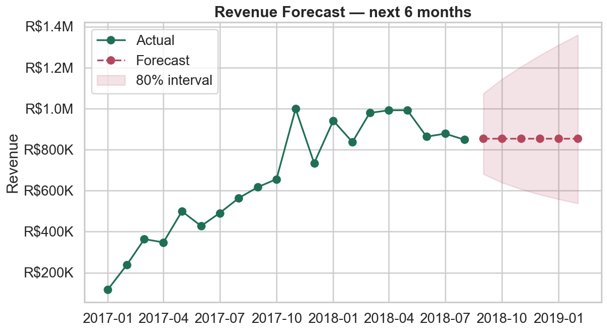
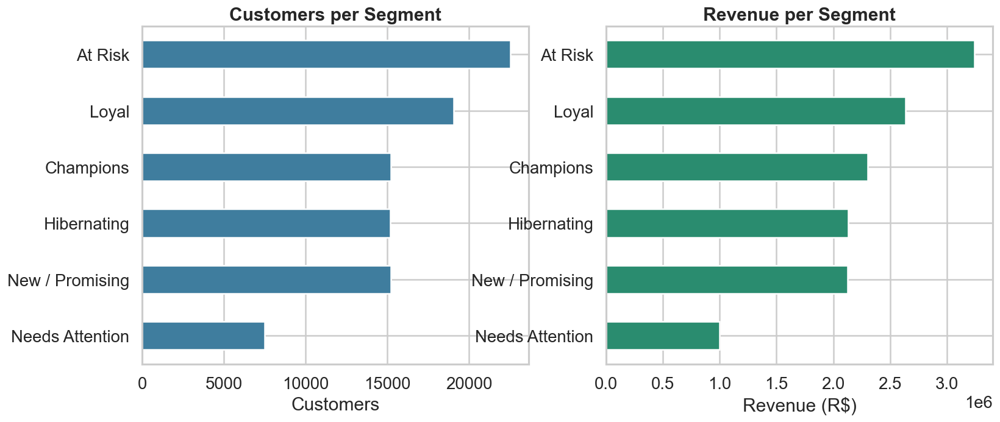
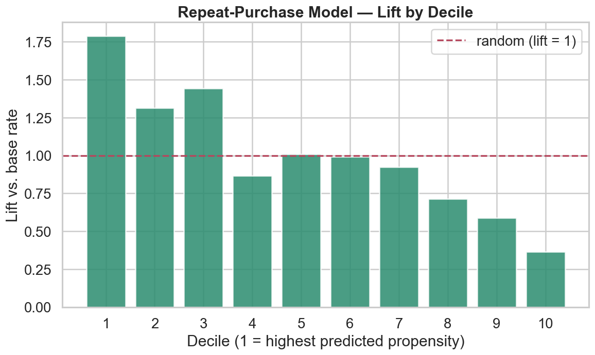
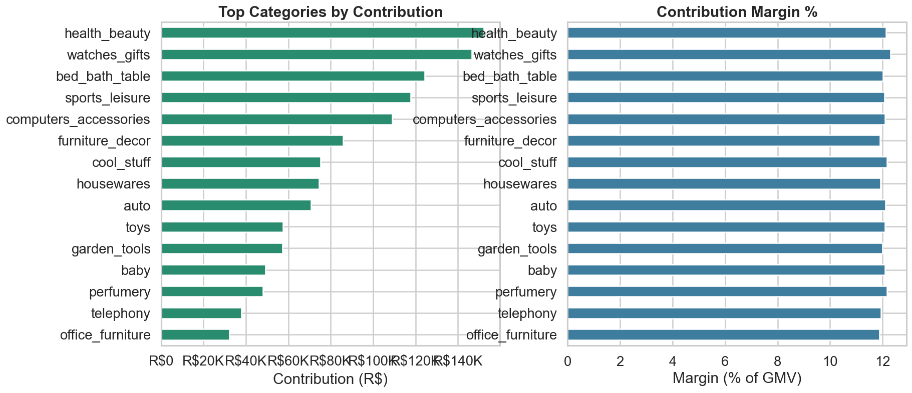
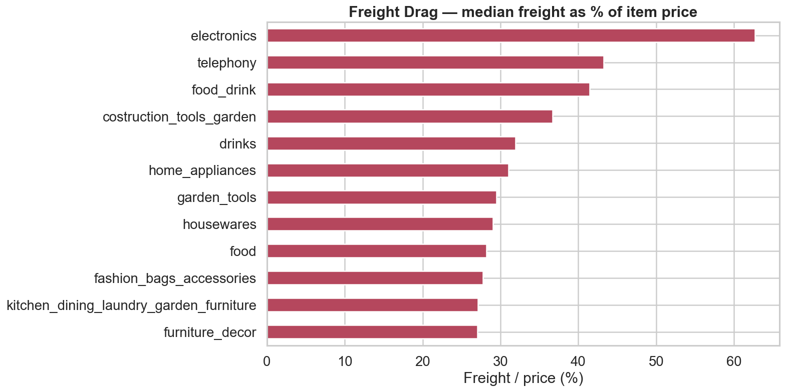

# Financial Operations Analytics

Revenue forecasting, churn, and profitability analysis on the
**Brazilian E-Commerce (Olist)** public dataset.

> Olist is a Brazilian marketplace connecting small sellers to large
> storefronts. The dataset covers ~100k orders from 2016–2018, with order
> items, payments, reviews, customers, sellers, products and geolocation.

## Goals

1. **Revenue forecasting** — model monthly GMV / revenue and project forward.
2. **Churn analysis** — segment customers (RFM) and predict repeat purchase.
3. **Profitability** — margins by category, seller and region; freight and
   payment economics.

## Key results

| | |
|---|---|
| Revenue (GMV) | **R$ 13.4M** over Jan 2017 – Aug 2018 |
| Repeat-buyer share | **3.0%** → retention is the biggest untapped lever |
| Forecast accuracy | **10.7% MAPE** (SARIMA, 4-month backtest) |
| Targeting lift | top propensity decile finds repeaters **1.8×** better than random |
| Margin insight | **freight (16.6% of GMV) > contribution (12.1%)** — logistics is the #1 margin lever |

**Revenue grew ~6× then plateaued; the forecast is honestly flat at ~R$855K/mo.**



| Customer segments (RFM) | Repeat-purchase targeting |
|---|---|
|  |  |

| Category profitability | Freight drag |
|---|---|
|  |  |

Full write-up with recommendations and caveats: **[reports/SUMMARY.md](reports/SUMMARY.md)**.

## Project layout

```
financial-ops-analytics/
├── data/
│   ├── raw/          # 9 Olist CSVs (git-ignored, ~120 MB)
│   └── processed/    # cleaned parquet tables (git-ignored)
├── src/
│   ├── config.py         # paths + business constants
│   ├── data_loader.py    # typed loaders for each raw CSV
│   ├── data_cleaning.py  # builds master / order-level / monthly tables
│   ├── eda.py
│   ├── revenue_forecast.py
│   ├── churn_analysis.py
│   ├── profitability.py
│   └── sql_runner.py     # runs sql/analytics.sql via DuckDB
├── sql/analytics.sql # core metrics expressed in SQL
├── app.py            # Streamlit dashboard
├── scripts/          # runnable entry points (run_pipeline.py)
├── reports/figures/  # generated charts
└── requirements.txt
```

## Setup

```bash
pip install -r requirements.txt

# Place the Kaggle "Brazilian E-Commerce by Olist" archive.zip, then:
unzip archive.zip -d data/raw

# Build processed tables (parquet) from raw CSVs:
python -m src.data_cleaning

# Or run the whole analysis end to end (tables + EDA + forecast + churn + margin):
python scripts/run_pipeline.py
```

Individual stages: `python -m src.eda` · `src.revenue_forecast` ·
`src.churn_analysis` · `src.profitability`. Figures land in `reports/figures/`.

**SQL metrics (DuckDB over parquet):**

```bash
python -m src.sql_runner                 # run all queries in sql/analytics.sql
python -m src.sql_runner top_categories  # run one by name
```

**Interactive dashboard (Streamlit):**

```bash
streamlit run app.py
```

## Data model (processed)

| Table | Grain | Use |
|-------|-------|-----|
| `orders_master`   | one row per **order item** | category / seller / profitability |
| `order_level`     | one row per **order**      | churn, forecasting inputs |
| `monthly_revenue` | one row per **month**      | time-series forecasting |

**Modeling conventions**
- Revenue is recognized from item `price` (excludes freight, installments, vouchers).
- `customer_unique_id` is the true customer; `customer_id` is per-order.
- Only `delivered` / `shipped` / `invoiced` orders count as realized revenue.

## Status

- [x] Phase 0 — scaffold
- [x] Phase 1 — data ingestion & cleaning pipeline
- [x] Phase 2 — exploratory data analysis (`python -m src.eda`)
- [x] Phase 3 — revenue forecasting (`python -m src.revenue_forecast`)
- [x] Phase 4 — churn analysis (`python -m src.churn_analysis`)
- [x] Phase 5 — profitability analysis (`python -m src.profitability`)
- [x] Phase 6 — pipeline runner + findings summary
- [x] SQL analytics layer (DuckDB) + Streamlit dashboard

## Dataset

Kaggle: *Brazilian E-Commerce Public Dataset by Olist* (CC BY-NC-SA 4.0).
Raw CSVs are not committed; download them from Kaggle and unzip into `data/raw/`.
