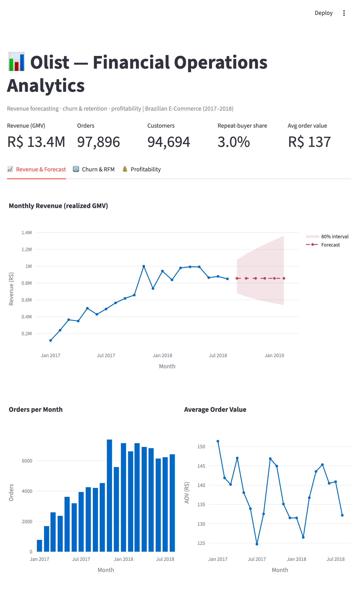

# Financial Operations Analytics

This is an end-to-end analysis of the public **Olist** Brazilian e-commerce
dataset, looking at it from a finance/ops angle: where the revenue comes from,
whether customers come back, and which parts of the business actually make
money once you account for freight and payment costs.

I picked Olist because it's messy in the way real transactional data is — nine
separate tables, multiple payment rows per order, the "customer" key isn't what
you'd expect — so it was a good excuse to practice building a proper pipeline
instead of working off one clean CSV.

## What I found

- **R$ 13.4M** in realized revenue across Jan 2017 – Aug 2018, growing roughly
  6× before flattening out into a ~R$1M/month plateau through 2018.
- Only **3% of customers ever order again.** That was the headline for me —
  acquisition is doing its job, retention basically isn't, so that's where the
  upside is.
- Best revenue forecast came in at **10.7% MAPE** on a 4-month holdout. The
  winning model just projects a flat ~R$855K/month, which felt anticlimactic
  until I realized that's the honest answer for a plateaued series.
- **Freight (16.6% of GMV) costs more than the platform's contribution margin
  (12.1%).** Logistics, not product mix, is the real margin lever here.


RFM customer segments and the repeat-purchase targeting model:

| | |
|---|---|
|  |  |

Profitability by category, and the freight-drag view that explains most of it:

| | |
|---|---|
|  |  |

The longer write-up with the recommendations is in
[reports/SUMMARY.md](reports/SUMMARY.md).

## Running it

```bash
pip install -r requirements.txt

# grab the Kaggle "Brazilian E-Commerce by Olist" archive, then:
unzip archive.zip -d data/raw

python scripts/run_pipeline.py     # builds tables + runs every analysis
```

`run_pipeline.py` does everything, but each stage also runs on its own:
`python -m src.eda`, `src.revenue_forecast`, `src.churn_analysis`,
`src.profitability`. Charts get written to `reports/figures/`.

There's also a SQL version of the core metrics (DuckDB reading the parquet files
directly, no database to set up):

```bash
python -m src.sql_runner                 # all queries
python -m src.sql_runner top_categories  # just one
```

And a Streamlit dashboard:

```bash
streamlit run app.py
```



## How the data is organized

After cleaning, everything reduces to three parquet tables at different grains:

| Table | One row per | Used for |
|-------|-------------|----------|
| `orders_master`   | order item | category / seller / profitability |
| `order_level`     | order      | churn, forecasting inputs |
| `monthly_revenue` | month      | the time series |

A few decisions worth calling out, since they drove most of the numbers:

- I count revenue from the item `price`, not `payment_value` — `payment_value`
  bundles in freight and gets distorted by installments and vouchers.
- `customer_unique_id` is the real person. `customer_id` is regenerated per
  order, so using it would have made the repeat rate look like ~0%. This tripped
  me up at first.
- Only `delivered` / `shipped` / `invoiced` orders count as realized revenue;
  canceled and unavailable ones are flagged and dropped from the totals.

## Things I'd flag / would do next

- The series is only ~20 dense months, so anything past a 6-month forecast is
  guesswork. I kept the models small on purpose rather than pretend otherwise.
- The repeat-purchase model is weak (ROC-AUC ~0.61). Rather than dress that up,
  I report it as decile lift — the top decile still finds repeaters ~1.8× better
  than random, which is the part that's actually useful for targeting.
- The commission/payment-fee rates in the profitability model are assumptions
  (`src/config.py`); the *rankings* hold regardless of the exact take-rate.
- Next things on my list: a customer-lifetime-value model, and using the
  geolocation table to tie freight cost to shipping distance.

## Dataset

Kaggle — *Brazilian E-Commerce Public Dataset by Olist* (CC BY-NC-SA 4.0). The
raw CSVs (~120 MB) aren't committed; download them and unzip into `data/raw/`.
